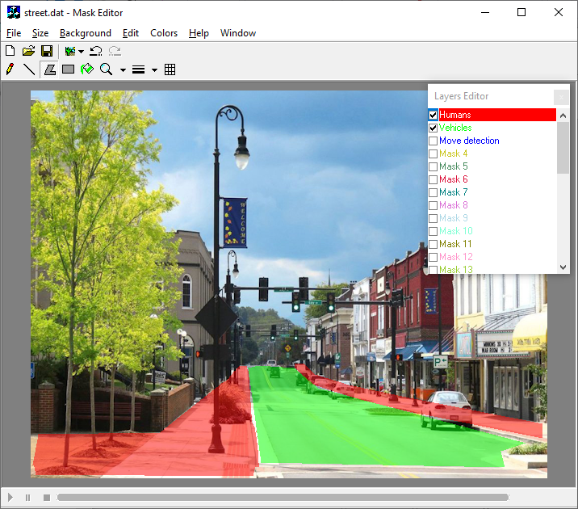

# Mask Editor

## What's this

MaskEdit(or) is a small painting application created back in 2004-2006 to traing a camera surveillance system.
The main objective is to create a bit mask (bit image) to shadow some camera areas in the image recognition pipeline.
It's an MS Paint-like application, but the number of painting tools is very limited:

- Straight line
- Pencil drawing curves
- Flood filling to fill closed areas
- Filled polygons and rectangles

Drawing while holding Shift key erases mask pixels.

The background can be
- empty
- loaded image
- playing video (avi format is 100% supported, DirectShow is used)

You can draw 32 layered masks, layers can be switched on/off.

Database saving/loading, camera image playing are turned off, too company-specific.

